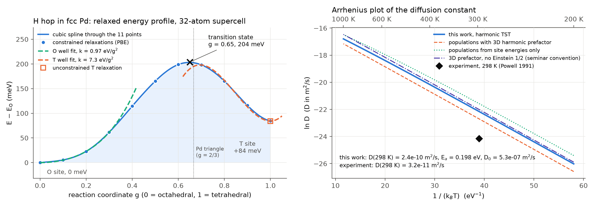
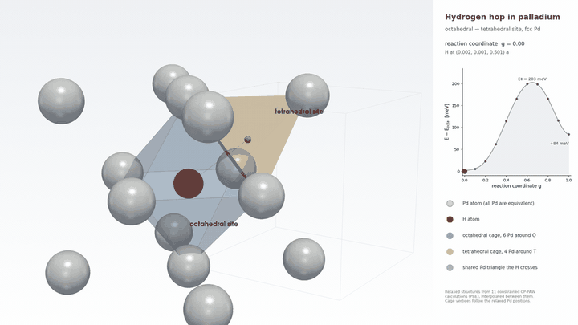
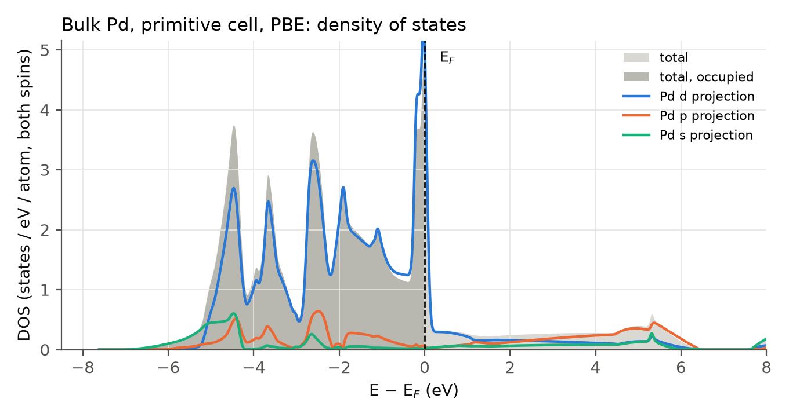
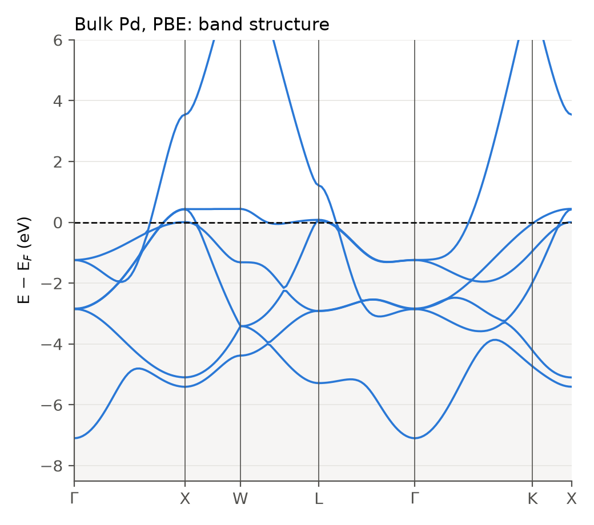
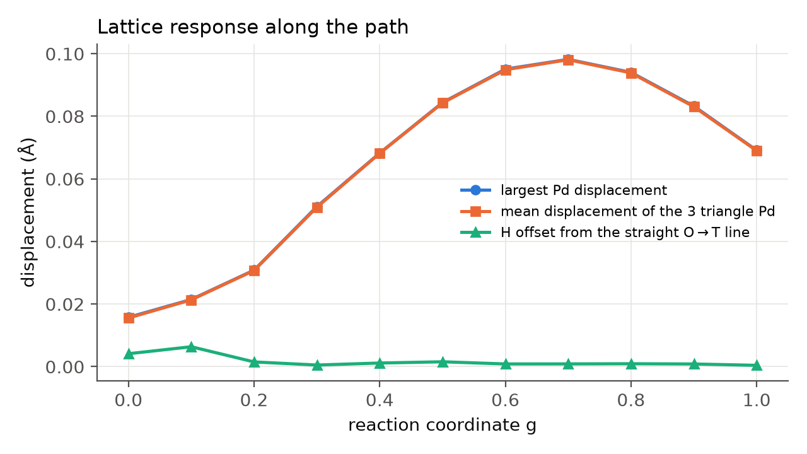
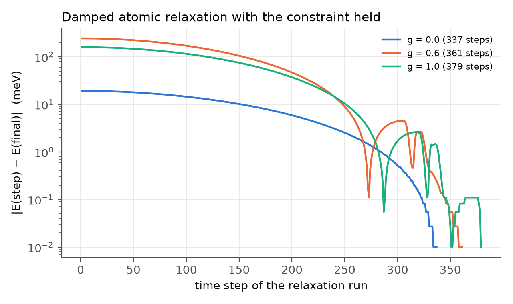
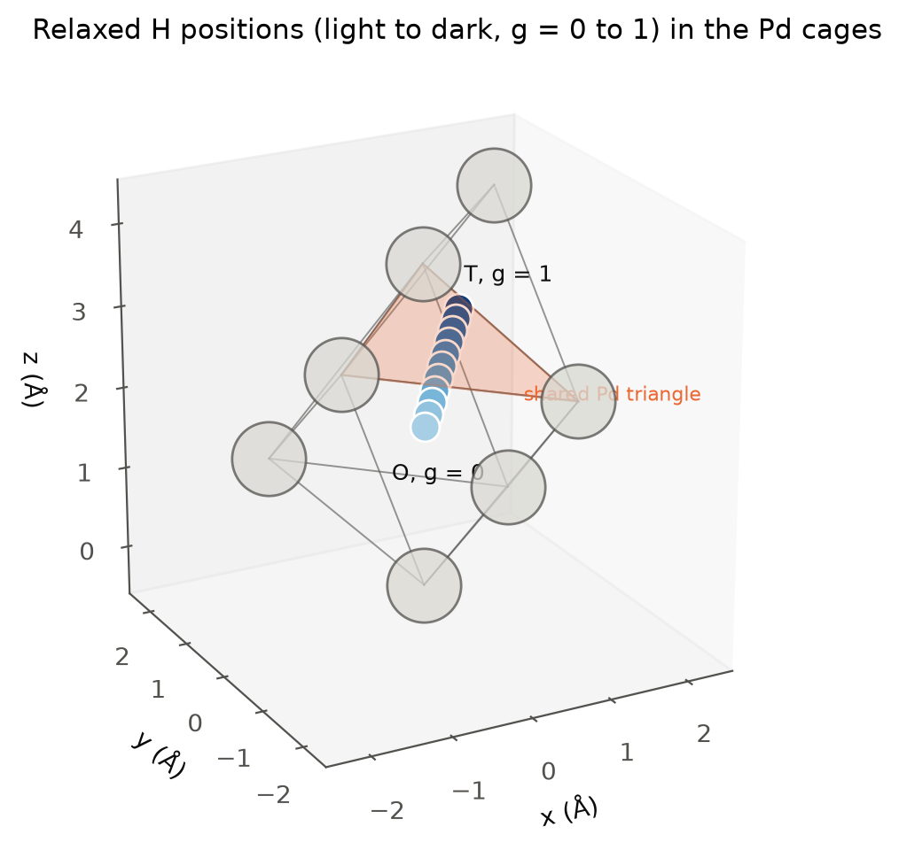

# pd-hydrogen-diffusion-dft

First-principles energy profile, jump rates and diffusion constant of interstitial hydrogen in fcc palladium, computed with the CP-PAW code and post-processed with the Python package in this repository.

*Origin: group project at the International CP-PAW Autumn School, Hands-on Course on Density-Functional Calculations, Goettingen, 31 August to 11 September 2026. The DFT runs were carried out on the school cluster by the project team; the post-processing code, figures and this write-up were built afterwards from the raw CP-PAW output.*





*Relaxed structures from the eleven constrained CP-PAW calculations, interpolated between them. The blue cage is the octahedral site with six Pd neighbours, the orange cage the tetrahedral site with four, and the H atom crosses the Pd triangle they share.*

## The question

Palladium dissolves atomic hydrogen into the voids of its fcc lattice and lets it move fast: the measured room-temperature diffusion coefficient is 3.2 x 10^-11 m^2/s. The project asks how far a plain density-functional calculation plus transition-state theory gets in predicting that number from scratch. Everything needed, the site energies, the barrier, the attempt frequencies and the hop geometry, comes out of one ladder of CP-PAW calculations.

## Calculation ladder

All runs use PBE, the projector augmented wave setups listed in the input files, a 30 Ry plane-wave cutoff, the experimental lattice constant 3.89 A, a density-based k-point grid (`!KPOINTS R=20`) and Mermin occupations with the tetrahedron method. The full inputs and gzipped protocol files are under `calculations/`.

| Stage | System | k-points | Bands | Result |
|---|---|---|---|---|
| 1 | Bulk Pd, primitive fcc cell, 1 atom | 63 | 10 | E = -30.00200 H, E_F = 21.435 eV, DOS and band structure |
| 2 | 2 x 2 x 2 cubic supercell, 32 Pd | 8 | 166 | E = -960.26196 H, 168 meV/atom below stage 1 (Brillouin-zone sampling, cancels in every difference used later) |
| 3 | 32 Pd + 1 H at the octahedral site O = (0, 0, 1/2) a | 8 | 166 | E = -960.84128 H, global minimum, Pd-H 1.955 to 1.966 A (ideal 1.945 A) |
| 3 | 32 Pd + 1 H at the tetrahedral site T = (1/4, 1/4, 3/4) a | 8 | 166 | E = -960.83819 H, local minimum 84.0 meV higher, Pd-H 1.753 A (ideal 1.684 A, +4 %) |
| 4 | Eleven constrained relaxations, reaction coordinate g = 0.0 to 1.0 in steps of 0.1 | 8 | 166 | Energy profile of the O to T hop, barrier 204 meV at g = 0.65 |

Each hydrogen calculation ran in two stages: wave-function optimisation with frozen atoms, then a damped Car-Parrinello relaxation of all atoms with the constraint held. The end points of the constrained path reproduce the unconstrained site energies to 0.003 meV (O) and 0.45 meV (T).

## The reaction coordinate

Pushing the H atom over the barrier with a plane constraint on its position alone does not work: the whole crystal can translate and satisfy any value of the constraint while sitting in the minimum. The coordinate used here measures the H position relative to the centre of the three Pd atoms of the triangle it has to cross,

```
g = (1, 1, 1) . ( 4/3 R_H  -  4/9 [ R_Pd(0,0,1) + R_Pd(1/2,0,1/2) + R_Pd(0,1/2,1/2) ] ) + 2/3
```

which is linear in the positions, invariant under a global translation, 0 at O and 1 at T for the ideal lattice. In CP-PAW this is a `!CONSTRAINTS!LINEAR` block whose vectors are the coefficients of the hyperplane, not positions:

```
!CONSTRAINTS
  !LINEAR SHOW=T MOVE=F
    !ATOM NAME='H_01' R=  1.33332  1.33332  1.33332 !END
    !ATOM NAME='PD17' R= -0.44444 -0.44444 -0.44444 !END
    !ATOM NAME='PD03' R= -0.44444 -0.44444 -0.44444 !END
    !ATOM NAME='PD04' R= -0.44444 -0.44444 -0.44444 !END
  !END
!END
```

`pdhdiff.structure.reaction_coordinate` implements the same function, and a test checks for every path point that the constraint value CP-PAW prints equals a (g - 2/3) in bohr and that g recomputed from the relaxed Cartesian positions matches the nominal value to 1e-4.

## Results

Numbers below are produced by `python scripts/run_all.py` from the committed protocol files and stored in `results/metrics.json`. The full table is in [results/RESULTS.md](results/RESULTS.md).

| Quantity | Value |
|---|---|
| E_T - E_O (unconstrained relaxations) | 84.0 meV |
| Transition state | g = 0.650, 203.8 meV above O (cubic spline: 203.0 meV at g = 0.648) |
| Activation energy O to T | 204 meV |
| Activation energy T to O | 119 meV |
| Curvature at O along the path | 0.97 eV per g^2, 5.5 N/m, hbar omega = 37.6 meV |
| Curvature at T along the path | 7.3 eV per g^2, 41 N/m, hbar omega = 103 meV |
| Largest Pd displacement along the path | 0.10 A at g = 0.7 (the three triangle atoms open the gate) |
| D(298 K), harmonic TST | 2.4 x 10^-10 m^2/s |
| D(298 K), experiment (Powell and Kirkpatrick 1991) | 3.2 x 10^-11 m^2/s |
| Effective Arrhenius activation energy, 200 to 1000 K | 0.198 eV (experiment about 0.23 eV) |
| Arrhenius prefactor D_0 | 5.3 x 10^-7 m^2/s |

The barrier lies beyond the Pd triangle (g = 2/3) on the tetrahedral side. The octahedral well is soft and nearly harmonic; the tetrahedral well is stiff and strongly anharmonic because moving past g = 1 heads straight into a Pd atom, so its curvature comes from a fit with a cubic term to the three points nearest to T.

The computed diffusion constant is a factor 7 too fast at room temperature while the activation energy is 30 meV too low. Both point the same way: PBE underestimates the barrier, and zero-point motion of the light H atom, which is larger in the stiff tetrahedral well and at the saddle, is neglected. The order of magnitude and the temperature dependence come out right, which is what a one-dimensional harmonic treatment can deliver.

### Conventions in the diffusion constant

The two-sublattice master-equation result is evaluated as

```
D = 1/2 sum_i P_i sum_j Gamma(j <- i) |r_j - r_i|^2 / 3
```

with the factor 1/2 of the Einstein relation, sublattice populations P_oct and P_tet from the one-dimensional harmonic wells, and hop rates Gamma = (omega_0 / 2 pi) exp(-E_a / k_B T). With these choices the forward and backward fluxes between the sublattices balance exactly (`detailed_balance_ratio_300K = 1.000` in the metrics file), so the two terms of the sum are equal and D reduces to P_oct Gamma(T <- O) a^2 / 2. The Arrhenius figure also shows three alternative conventions: Boltzmann populations without a vibrational prefactor, the three-dimensional harmonic prefactor of the project description, and the expression without the factor 1/2 as it was used on the seminar slides. They change D(298 K) by at most a factor 1.8 and do not alter the conclusion.

## Electronic structure of the host

| Density of states | Band structure |
|---|---|
|  |  |

The occupied states from -5.1 eV to E_F are Pd 4d; E_F sits on the sharp peak at the top of the nearly full d band, which is why fractional occupations (`!MERMIN`) are mandatory and why Pd is so reactive towards hydrogen. Integrating the occupied total DOS gives 9.96 electrons for the 10 valence electrons of the setup. The coarse R = 20 grid makes the DOS jagged, as the project description anticipates; it does not affect the energy differences used above.

## Lattice response and convergence

| Relaxed geometry along the path | Convergence of the constrained relaxations |
|---|---|
|  |  |

The H atom stays on the straight O to T line to within 0.007 A; the lattice does the rest. The three triangle atoms move outward by up to 0.10 A near the barrier. Every relaxation reached the automatic stop criterion in 337 to 379 steps.



## Reproduce

```bash
git clone https://github.com/aamirmalik-dr/pd-hydrogen-diffusion-dft.git
cd pd-hydrogen-diffusion-dft
python -m venv .venv && .venv/Scripts/activate      # or source .venv/bin/activate
pip install -e .[dev]
python scripts/run_all.py      # profile, TST analysis, electronic structure, path figures
pytest -q                      # 20 tests: parsers, geometry, fits, regression against results/
```

Individual steps, also reachable through the `pdhdiff` console script:

```bash
python scripts/extract_profile.py           # calculations/ -> results/profile.csv, results/sites.json
python scripts/analyze_diffusion.py         # fits, rates, D(T) -> results/metrics.json and figures
python scripts/plot_electronic_structure.py # DOS and bands of bulk Pd
python scripts/make_path_figures.py         # trajectory xyz, geometry and convergence figures
python scripts/build_path_inputs.py         # regenerate the eleven constrained .strc inputs
```

`notebooks/walkthrough.ipynb` is an executed notebook that goes through the same chain interactively. Verified on Windows 11 with Python 3.11 in a fresh virtual environment; the only dependencies are NumPy, SciPy and Matplotlib. CP-PAW itself is not needed to run anything here, only to redo the DFT.

## Repository layout

```
calculations/   CP-PAW inputs (.strc, .cntl), gzipped protocols (.prot.gz), DOS and band data
  01_pd_primitive/  02_pd_supercell/  03_h_octahedral/  03_h_tetrahedral/  04_path_octa_to_tetra/g_0.0 ... g_1.0
src/pdhdiff/    cppaw_io (parsers), structure (fcc sites, reaction coordinate, constraint block),
                profile (energy profile and fits), tst (rates, populations, D), plotting, cli
scripts/        the five processing steps and run_all.py
results/        profile.csv, sites.json, metrics.json, diffusion_vs_T.csv, path_trajectory.xyz, RESULTS.md
figures/        all figures in this README, regenerated by the scripts
docs/           theory.md (transition-state theory as used here), cppaw_workflow.md (how the runs were set up),
                slides/ (the seminar presentation, PDF), media/ (hop animation), img/ (site schematics)
tests/          pytest suite
```

## Scope, honestly

This is a course-scale calculation and is reported as such. One 32-atom supercell, 8 k-points, no cutoff or cell-size convergence study, no zero-point or tunnelling corrections, no isotope effect, a one-dimensional reaction coordinate instead of a nudged-elastic-band search, harmonic wells with the curvature taken along the path only, and uncorrelated hops. The barrier and the diffusion constant are therefore accurate to tens of meV and to an order of magnitude respectively, which is the level the comparison with experiment shows. The DFT runs themselves are not rerun here; the repository contains their complete inputs and outputs and the code that turns them into the numbers above.

## References

- P. E. Bloechl, Projector augmented-wave method, Phys. Rev. B 50, 17953 (1994). CP-PAW: https://cppaw.org
- G. H. Vineyard, Frequency factors and isotope effects in solid state rate processes, J. Phys. Chem. Solids 3, 121 (1957).
- G. L. Powell and J. R. Kirkpatrick, Surface conductance and the diffusion of H and D in Pd, Phys. Rev. B 43, 6968 (1991).
- J. Voelkl and G. Alefeld, in Hydrogen in Metals I, Topics in Applied Physics 28, Springer (1978).
- K. Lee, M. Yuan and J. Wilcox, Understanding deviations in hydrogen solubility predictions in transition metals through first-principles calculations, J. Phys. Chem. C 119, 19642 (2015).

## Acknowledgements

The project was set up by the organisers of the CP-PAW Autumn School 2026 (https://cppaw.org/doku.php?id=handson:handson2026) and carried out together with Annika Koelle and Parsa Rahmani, who co-authored the seminar presentation in `docs/slides/`. The CP-PAW code is developed by Peter Bloechl and distributed under the GPL.

## Author

Aamir Malik
GitHub: https://github.com/aamirmalik-dr
LinkedIn: https://linkedin.com/in/aamirmalik-dr

## License

MIT (see LICENSE). The CP-PAW input and output files are shared for reproducibility of this project; CP-PAW itself is licensed separately by its authors.
