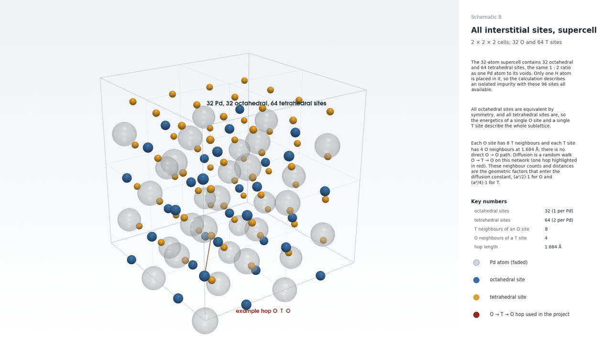

# Transition-state theory as used in this project

This note states the approximations behind `pdhdiff.tst` in the order they are applied, with the equations exactly as the code evaluates them.

## Sites and hops

Interstitial hydrogen in fcc Pd occupies the octahedral (O) and tetrahedral (T) voids. Per Pd atom there is one O site and two T sites. Every O site has eight T neighbours and every T site four O neighbours, all at a distance sqrt(3) a / 4 = 1.684 A. There is no direct O to O hop through the lattice; diffusion is a random walk O to T to O.



## Rates

Each hop is thermally activated. In the simplest form of transition-state theory (one dimension, harmonic well, no correlated jumps, classical nuclei) the rate per pathway is

```
Gamma = (omega_0 / 2 pi) exp(-E_a / k_B T)
```

with E_a the barrier height seen from the initial site and omega_0 = sqrt(k / m) the attempt frequency, from the curvature k of the energy profile at the initial minimum and the mass m of the hydrogen atom. The profile is measured along the reaction coordinate g, so the curvature k_g in eV per g^2 is converted with the path length L = |T - O|: k = k_g / L^2.

## Populations

The fraction of time spent on each sublattice follows from the harmonic partition functions of the wells. For a one-dimensional well the population of a site is proportional to exp(-V_i / k_B T) / omega_i, so

```
P_tet / P_oct = (N_T / N_O) (omega_O / omega_T) exp(-(E_T - E_O) / k_B T)
```

with N_T / N_O = 2. This is the choice that satisfies detailed balance with the one-dimensional rates above, P_oct 8 Gamma(T <- O) = P_tet 4 Gamma(O <- T). The project description writes the three-dimensional version with (omega_O / omega_T)^3, assuming isotropic wells with the curvature taken along the path; the code offers it as an option (`population_mode="harmonic3d"`), together with plain Boltzmann populations.

## Diffusion constant

The master equation for the site populations coarse-grains to a diffusion equation with

```
D = 1/2 sum_i P_i sum_j Gamma(j <- i) (r_j - r_i) (x) (r_j - r_i)
```

The factor 1/2 is the Einstein relation <dr (x) dr> = 2 D t; for a one-dimensional chain with spacing l and rate Gamma in each direction the formula gives D = Gamma l^2, the textbook result. The project description prints the expression without the 1/2; `diffusion_constant(..., einstein_half=False)` reproduces that convention. The geometric sums are isotropic in a cubic crystal, (a^2 / 2) 1 for hops out of O and (a^2 / 4) 1 for hops out of T, so D is a scalar.

## Isotopes

The Born-Oppenheimer profile does not depend on the mass, so in classical harmonic TST an isotope only rescales the attempt frequencies by sqrt(m_H / m): D_D / D_H = 0.707 and D_T / D_H = 0.577 at every temperature (`pdhdiff.tst.with_mass`). The measured isotope effect of hydrogen in metals is dominated by zero-point energy and tunnelling, so this classical ratio is a reference point, not a prediction.

## What is left out

Zero-point energy of the H atom (hbar omega is 38 meV at O and 103 meV at T along the path, and different again at the saddle), tunnelling, the full 3N-dimensional harmonic prefactor of Vineyard's theory, anharmonic corrections to the wells, correlated return jumps from T back to the same O, finite-size and k-point convergence of the DFT energies, and the PBE error in the barrier itself. Each of these is a known correction; none was applied.
